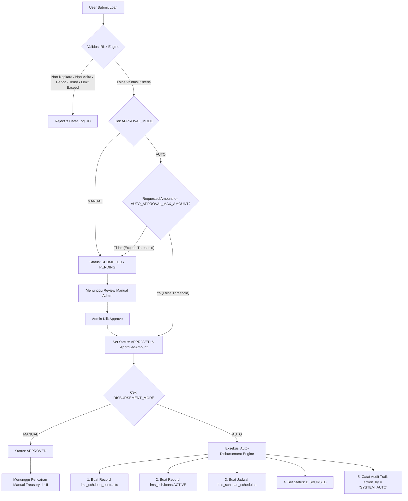

# Proposal Arsitektur Teknikal: Otomatisasi Approval & Pencairan Dana (Disbursement) Pinjaman LMS

**Sistem:** LMS (Loan Management System) — Koperasi Kopkara  
**Tanggal:** 22 Agustus 2026  
**Status:** Proposal Resmi (Siap Dieksekusi Berdasarkan Persetujuan User)  

---

## 1. Ringkasan Eksekutif

Proposal ini mendokumentasikan desain arsitektur untuk mendukung **Otomatisasi Approval** dan **Otomatisasi Pencairan Dana (Disbursement)** pada Loan Management System (LMS) Kopkara.

Seluruh alur persetujuan dan pencairan dana dikontrol secara dinamis melalui **Parameter Engine (`global_parameters`)**, sehingga sistem dapat berjalan dalam mode **Full Manual**, **Hybrid**, maupun **Full Straight-Through Processing (STP) Otomatis 100%**.

---

## 2. Parameter Konfigurasi Global (`lms_sch.global_parameters`)

Sistem menggunakan 3 parameter kunci di `lms_sch.global_parameters` yang dibaca secara *real-time* dari in-memory cache backend Go:

| Parameter | Default | Opsi Nilai | Deskripsi Fungsi |
|---|---|---|---|
| `APPROVAL_MODE` | `MANUAL` | `MANUAL` / `AUTO` | Mode persetujuan pengajuan (`MANUAL`: review Admin, `AUTO`: persetujuan otomatis jika lolos kriteria) |
| `AUTO_APPROVAL_MAX_AMOUNT` | `0` | Nominal Numeric | Batas maksimum nominal pinjaman untuk auto-approve (`0` = tanpa batasan nominal) |
| `DISBURSEMENT_MODE` | `MANUAL` | `MANUAL` / `AUTO` | Mode pencairan dana (`MANUAL`: konfirmasi transfer Admin, `AUTO`: otomatis terbit kontrak, loan, & jadwal cicilan) |

---

## 3. Matriks Kombinasi Mode Operasional LMS

Dengan kombinasi parameter di atas, Kopkara memiliki 4 pilihan mode operasional yang dapat di-switch sewaktu-waktu dalam **< 1 detik**:

| Mode Operasional | `APPROVAL_MODE` | `DISBURSEMENT_MODE` | Deskripsi Alur Kerja |
|---|---|---|---|
| **1. Full Manual (Default)** | `MANUAL` | `MANUAL` | Submit $\rightarrow$ Status `SUBMITTED` $\rightarrow$ Review Admin $\rightarrow$ `APPROVED` $\rightarrow$ Transfer Treasury $\rightarrow$ `DISBURSED`. |
| **2. Auto Approval, Manual Disburse** | `AUTO` | `MANUAL` | Submit $\rightarrow$ Auto-Approve `APPROVED` $\rightarrow$ Petugas Treasury verifikasi & cairkan via UI $\rightarrow$ `DISBURSED`. |
| **3. Manual Approval, Auto Disburse** | `MANUAL` | `AUTO` | Submit $\rightarrow$ Review Admin $\rightarrow$ Saat Admin Approve, sistem **langsung otomatis cairkan** $\rightarrow$ `DISBURSED`. |
| **4. Full STP Automation (100% Otomatis)** | `AUTO` | `AUTO` | Submit $\rightarrow$ Validasi Risiko $\rightarrow$ Auto-Approve $\rightarrow$ Auto-Disburse $\rightarrow$ Status langsung `DISBURSED` dalam 1 detik! |

---

## 4. Diagram Alur Kerja Sistem (Flowchart Transaksi)



---

## 5. Mekanisme Kerja Auto-Disbursement Engine

Ketika pengajuan pinjaman mencapai status `APPROVED` dan parameter `DISBURSEMENT_MODE = AUTO`, backend Go secara atomis (*Atomic Database Transaction*) mengeksekusi langkah berikut:

1. **Pembentukan Kontrak (`lms_sch.loan_contracts`)**:
   Menerbitkan nomor kontrak unik (misal: `CNT-202608-1787405426`), menyimpan nominal yang disetujui, tenor, suku bunga, dan tanggal efektif.
2. **Pembentukan Rekening Pinjaman (`lms_sch.loans`)**:
   Membuat record pinjaman aktif berstatus `ACTIVE` dengan saldo kewajiban awal `outstanding_amount = approved_amount`.
3. **Pembentukan Jadwal Cicilan Bulanan (`lms_sch.loan_schedules`)**:
   Men-generate matriks cicilan sebanyak `tenor` bulan. Tanggal jatuh tempo (`due_date`) angsuran pertama secara otomatis menggunakan kalkulasi parameter **`LOAN_DUEDATE`** (tanggal) dan **`LOAN_DUEMONTH`** (bulan).
4. **Pembaruan Status Pengajuan (`lms_sch.loan_applications`)**:
   Mengubah status pengajuan pinjaman menjadi **`DISBURSED`**.
5. **Perekaman Audit Trail (`lms_sch.loan_trackings`)**:
   Menuliskan log histori persetujuan dan pencairan otomatis:
   - `action_by`: `'SYSTEM_AUTO'`
   - `action`: `'AUTO_DISBURSED'`
   - `approval_notes`: `"Auto-disbursed by System Automation"`

---

## 6. Naskah DML SQL Parameter (`backend/migrations/seed_approval_and_disbursement_parameters.sql`)

```sql
-- =========================================================================
-- DML SQL UNTUK PARAMETER OTOMATISASI APPROVAL & DISBURSEMENT PINJAMAN
-- DI POSTGRESQL (PgAdmin / LMS)
-- =========================================================================

INSERT INTO lms_sch.global_parameters (key_name, key_value, description) VALUES
('APPROVAL_MODE', 'MANUAL', 'Mode persetujuan pinjaman (MANUAL: review admin, AUTO: persetujuan otomatis)'),
('AUTO_APPROVAL_MAX_AMOUNT', '0', 'Maksimum nominal pinjaman untuk auto-approve (0 = tanpa batasan nominal)'),
('DISBURSEMENT_MODE', 'MANUAL', 'Mode pencairan pinjaman (MANUAL: transfer admin, AUTO: otomatis terbit kontrak & jadwal)')
ON CONFLICT (key_name) DO UPDATE SET 
    key_value = EXCLUDED.key_value,
    description = EXCLUDED.description;

-- Verifikasi Parameter setelah Eksekusi
SELECT id, key_name, key_value, description 
FROM lms_sch.global_parameters 
WHERE key_name IN ('APPROVAL_MODE', 'AUTO_APPROVAL_MAX_AMOUNT', 'DISBURSEMENT_MODE')
ORDER BY id ASC;
```

---

## 7. Kesimpulan & Rekomendasi AI

> [!TIP]
> **REKOMENDASI AI: OPSI PARAMETER ENGINE (SINGLE CODEBASE)**

### 💡 Keunggulan Utama Opsi Parameter Engine:
1. **Dukungan Penuh Otomatisasi Approval & Disbursement**: LMS dapat menangani pencairan dana otomatis 100% tanpa memerlukan sistem terpisah.
2. **Kemudahan Kontrol Operasional**: Pengelola Kopkara bebas memilih 4 mode operasional di atas cukup dengan mengubah parameter di UI *Master Global Parameter* secara *real-time*.
3. **Efisien & Tanpa Biaya Infrastruktur Ganda**: Tidak memerlukan 2 server/VM terpisah, menghemat biaya operasional & pemeliharaan kode.
