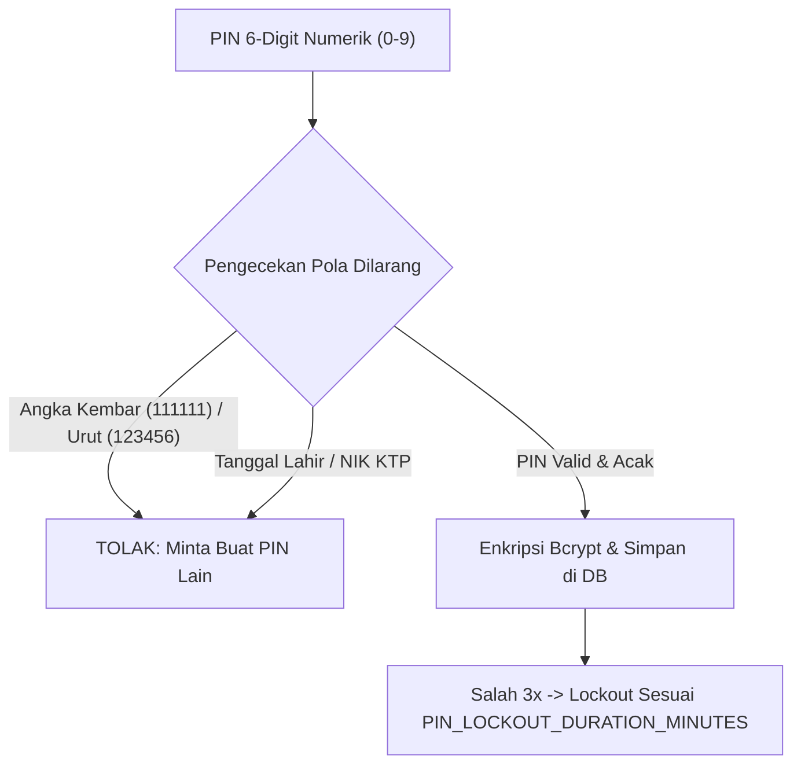

# PROPOSAL PENGEMBANGAN SELF-SERVICE MOBILE APPLICATION EWA/LMS & INTEGRASI DISBURSEMENT ENGINE 24/7

**Dokumen Spesifikasi & Rekomendasi Arsitektur**  
**Sistem:** Loan Management System (LMS) & Earned Wage Access (EWA) Kopkara  
**Tanggal:** 24 Agustus 2026  
**Status:** Draf Usulan Arsitektur & Kebijakan Keamanan Sistem (Diperbarui Berdasarkan Review Keamanan)  

---

## 1. RINGKASAN EKSEKUTIF (EXECUTIVE SUMMARY)

Perkembangan layanan **Earned Wage Access (EWA)** dan **Loan Management System (LMS)** menuntut kecepatan, kemudahan akses, serta keandalan pencairan dana 24/7. Transisi dari pengajuan berbasis web/manual menjadi **Self-Service Mobile Application (Android/iOS)** akan meningkatkan adopsi anggota Kopkara secara signifikan, sekaligus menekan biaya operasional administrasi.

Proposal ini menyajikan rekomendasi teknis komprehensif mengenai:
1. **Arsitektur Registrasi & Autentikasi Mobile vs Web**: Menggunakan No. HP + PIN 6 Digit untuk Mobile Apps Anggota dan Username + Password untuk Web Portal Admin/HRD.
2. **Kebijakan Keamanan Dinamis di `global_parameters`**: Konfigurasi parameter keamanan PIN/Password yang dapat diatur fleksibel melalui UI Parameter (Max Salah PIN, Durasi Lockout, Idle Timeout, Rotasi 90 Hari).
3. **Panduan Teknis WA OTP Gratis & Kredensial Meta API**: Pengujian $0 tanpa API Meta via Static Mocking serta penjelasan kredensial Meta (`META_WA_PHONE_NUMBER_ID` & `META_WA_ACCESS_TOKEN`).
4. **Strategi Infrastruktur Pencairan Uang (Disbursement Engine 24/7)**: Evaluasi vendor *Payment Gateway* / *Disbursement API* (Xendit, Midtrans Iris, Flip for Business) serta jalur langsung *Direct Bank SNAP API (BI-FAST H2H)*.

---

## 2. ARSITEKTUR MOBILE APPLICATION & WEB PORTAL

```mermaid
flowchart TD
    subgraph Mobile Apps (Anggota EWA)
        M1["Input Data (No. KTP, Employee ID, Nama Karyawan, No. HP)"] --> M2["Auto Match DB HRD (lms_sch.employees)"]
        M2 --> M3["OTP Pendaftaran Pertama Kali"]
        M3 --> M4["Buat PIN 6 Digit (Password Backup)"]
        M4 --> M5["Login Harian Mobile (No. HP + PIN 6 Digit)"]
    end

    subgraph Web Portal (Admin / HRD / Management)
        W1["Akses Portal Browser PC"] --> W2["Login Web (Username + Password)"]
        W2 --> W3["Otorisasi RBAC (Admin / HRD / Finance)"]
    end
```

---

## 3. KEBIJAKAN KEAMANAN DINAMIS PADA `global_parameters`

Untuk fleksibilitas manajemen, seluruh aturan keamanan **Password** dan **PIN 6-Digit** disimpan sebagai **Global Parameters** di database (`lms_sch.global_parameters`). Admin Kopkara dapat mengubah batas keamanan secara langsung melalui UI Master Parameter tanpa perlu memodifikasi kode program.

### 3.1. Daftar Parameter Keamanan di `lms_sch.global_parameters`

| Key Parameter (`key_name`) | Nilai Default (`key_value`) | Keterangan & Deskripsi Fungsi |
|---|---|---|
| `PIN_MAX_FAILED_ATTEMPTS` | `"3"` | Maksimal kesalahan input PIN berturut-turut sebelum akun terkunci. |
| `PIN_LOCKOUT_DURATION_MINUTES` | `"15"` | Durasi penguncian aplikasi (dalam menit) jika salah PIN 3x. |
| `PIN_IDLE_TIMEOUT_MINUTES` | `"3"` | Batas waktu idle/background aplikasi mobile sebelum meminta PIN ulang. |
| `PASSWORD_MAX_FAILED_ATTEMPTS` | `"3"` | Maksimal kesalahan input password berturut-turut di Web Portal. |
| `PASSWORD_ROTATION_DAYS` | `"90"` | Masa berlaku password (dalam hari) sebelum wajib diganti baru. |
| `PASSWORD_MIN_LENGTH` | `"9"` | Panjang minimal karakter password. |

---

### 3.2. Kebijakan Keamanan PIN 6-Digit & Password



1. **Aturan PIN 6-Digit**:
   - **Pola Dilarang**: Dilarang 6 angka kembar (`111111`), angka berurutan (`123456`), atau tanggal lahir/NIK.
   - **Lockout Policy**: Jika salah PIN sebanyak `PIN_MAX_FAILED_ATTEMPTS` (default 3x), aplikasi terkunci selama `PIN_LOCKOUT_DURATION_MINUTES` (default 15 menit).
   - **Auto-Lock Timeout**: Jika aplikasi berada di background melebihi `PIN_IDLE_TIMEOUT_MINUTES` (default 3 menit), aplikasi terkunci otomatis dan meminta PIN/Biometrik ulang.
2. **Aturan Password**:
   - Kedaluwarsa setiap `PASSWORD_ROTATION_DAYS` (default 90 hari).
   - Panjang minimal `PASSWORD_MIN_LENGTH` (default 9 karakter, kombinasi 1 Huruf Besar, 1 Huruf Kecil, 1 Angka, 1 Karakter Spesial).
   - Enkripsi hashing **Bcrypt (Cost 10-12)**.

---

## 4. PANDUAN TEKNIS WA OTP GRATIS & KREDENSIAL META API

### 4.1. Rincian Kredensial Meta WhatsApp API pada `.env.production`

Pertanyaan: *"Meta akan kirim token saja, lainnya tidak perlu diganti?"*

**Penjelasan Kredensial Meta**:
Meta menyediakan **2 data utama** di portal *Meta for Developers* saat pendaftaran WhatsApp Cloud API resmi:
1. `META_WA_ACCESS_TOKEN`: Token autentikasi rahasia (*System User Permanent Access Token*).
2. `META_WA_PHONE_NUMBER_ID`: ID unik nomor HP pengirim dari Meta (misal: `109283746501928`).

Variabel lain pada file `.env.production` **TIDAK PERLU DIGANTI** karena merupakan konfigurasi standar sistem:

```env
# Provider OTP Aktif (Menggunakan Official WA Meta)
ENABLE_MOCK_OTP=false
OTP_PROVIDER=whatsapp_meta

# Kredensial Resmi Dari Meta (Cukup Diisi 2 Data Ini)
META_WA_PHONE_NUMBER_ID=109283746501928
META_WA_ACCESS_TOKEN=EAAG...
```

---

## 5. STRATEGI VENDOR DISBURSEMENT (TRANSFER UANG 24/7)

| Vendor / Provider | Keunggulan Utama | Biaya Estimasi per Transaksi |
|---|---|---|
| **Xendit (Disbursements API)** | Uptime >99.9% + Auto-retry & Webhook akurat. | Rp 2.500 – Rp 4.000 / transfer |
| **Midtrans (Iris Payouts)** | Ekosistem GoTo Group (GoPay) & Laporan Audit Enterprise. | Rp 2.500 – Rp 4.000 / transfer |
| **Flip for Business** | Efisiensi biaya tinggi untuk transaksi mikro harian. | Rp 2.000 – Rp 3.000 / transfer |
| **Direct Bank SNAP API (BI-FAST H2H)** | Koneksi langsung perbankan via BI-FAST (Tanpa Perantara). | Biaya BI-FAST (Rp 2.500 / nego) |

---

## 6. KESIMPULAN

Seluruh parameter keamanan PIN dan Password (`PIN_MAX_FAILED_ATTEMPTS`, `PIN_LOCKOUT_DURATION_MINUTES`, `PIN_IDLE_TIMEOUT_MINUTES`, `PASSWORD_ROTATION_DAYS`) kini dikonfigurasi secara dinamis di `lms_sch.global_parameters`. Konfigurasi Meta WhatsApp API di Production cukup mengisi `META_WA_PHONE_NUMBER_ID` dan `META_WA_ACCESS_TOKEN` dari Meta.
